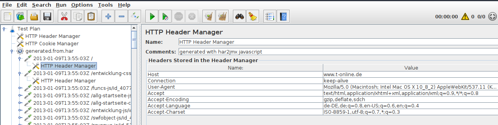
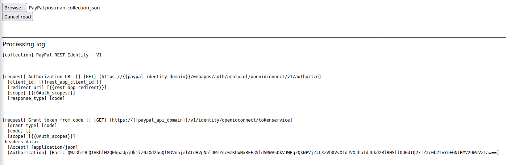
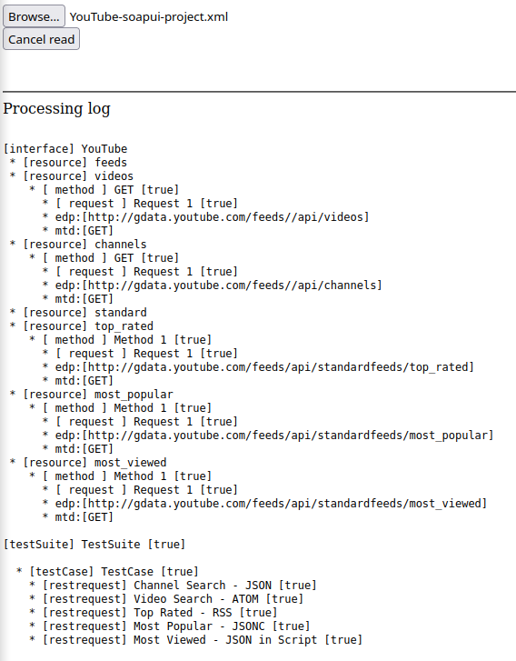
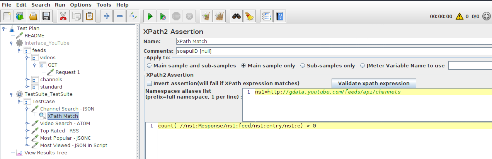

#### JMeter converters

This is a set of converters for generating .jmx files form other well known formats:

 * har
 * postman collection
 * soapui projects

Simple open with your browser related html converter file from `sets` directory. Then browse for file to be converted. Your .jmx file will be downloaded to default downloads location, as set in your browser.

Here are samples for processing of specyfic files and results:

 * har

   processing:

   

   results:

   

 * postman

   processing:

   

   results:

   

 * soapui

   processing:

   

   results:

   

